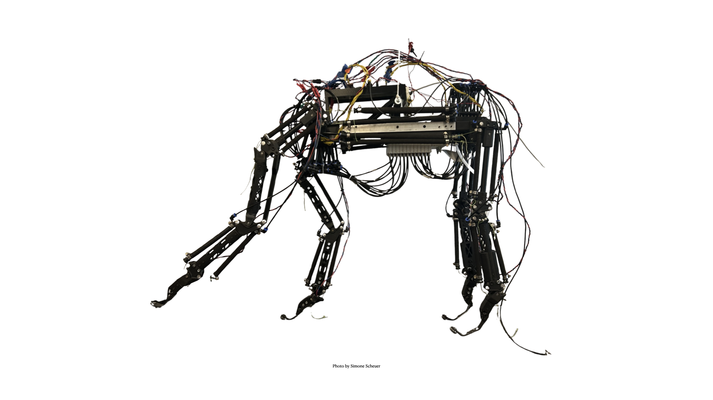
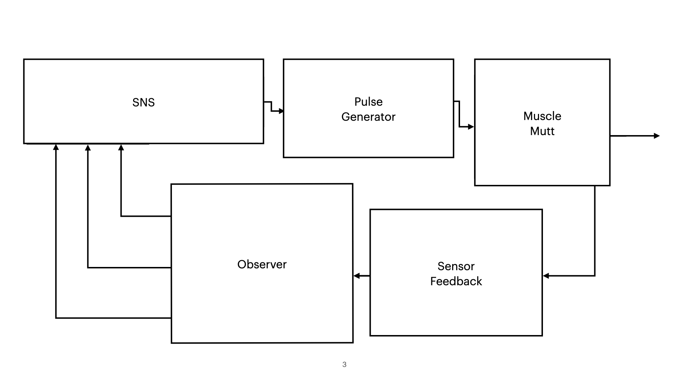
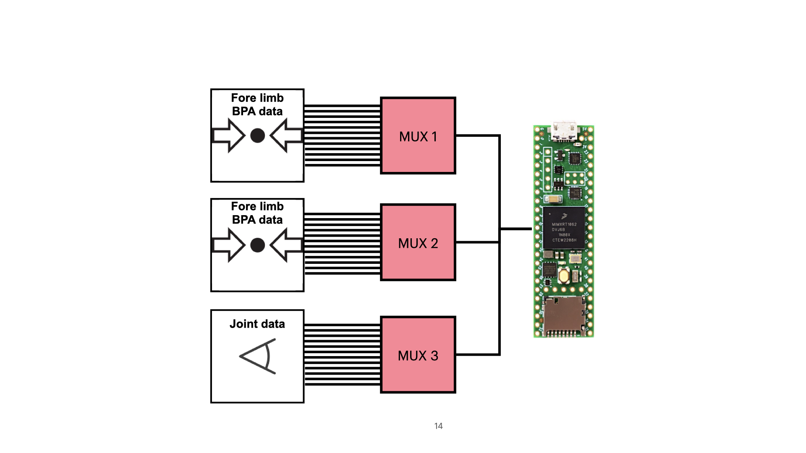
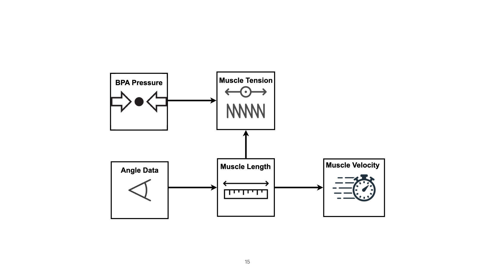

- [System Overview](#system-overview)
- [Communication Protocol](#communication-protocol)
  - [Teensy 4.1](#teensy-41)
    - [Spike Activation Pipeline](#spike-activation-pipeline)
    - [Sensory Data Pipeline](#sensory-data-pipeline)
- [Codebase](#codebase)
  - [Virtual Environment](#virtual-environment)
  - [Run the Code](#run-the-code)
  - [dog\_sitter.py](#dog_sitterpy)
    - [main()](#main)
    - [run\_sim()](#run_sim)
      - [for i in range(1, num\_steps):](#for-i-in-range1-num_steps)
    - [Plotting](#plotting)
  - [Python](#python)
    - [Modes of Operation](#modes-of-operation)
      - [Feed Forward](#feed-forward)
      - [Muscle Mutt](#muscle-mutt)
        - [Muscle Data in Simulation](#muscle-data-in-simulation)
      - [Make Video](#make-video)
    - [Serial Pipeline](#serial-pipeline)
      - [*Troubleshooting: Serial Paths*](#troubleshooting-serial-paths)
      - [*Troubleshooting: Sensory Data Teensy*](#troubleshooting-sensory-data-teensy)
- [Adjust walking speed](#adjust-walking-speed)
  - [](#)



# System Overview

It is fairly complicated to generate stable locomotion in a quadrupedal robot, and doing so with spike activations to BPAs with closed-loop control from a Synthetic Nervous System (SNS) is a novel method.
In addition, SNSs are notoriously difficult to tune; though, when done so properly, they can be a robust control method.

This codebase connects a synthetic nervous system --originally developed to generate stable walking in the hind limbs of a rat model-- to a quadruped robot actuated by BPAs, known as Muscle Mutt.
The quadruped robot in question is Muscle Mutt, the BPA-actuated platform used in the Agile and Adaptive Robotics lab as a means of testing biologically-plausible neural controllers.
Thus, this works attempts to provide a structure for "controller interfaces" which bridge the gaps in the many-input/many-output control scheme to create locomotion in the quadruped robot. 

In this README, I will breifly describe the physical platform, Muscle Mutt, and its set of BPA valves, BPAs, BPA pressure sensors, and joint angle sensors (potentiometers).
However, an in depth description of Muscle Mutt's development can be found in [Cody Scharzenberger's masters thesis](https://pdxscholar.library.pdx.edu/open_access_etds/5135/).
Additionally, I will also discuss the modifications to Clayton Jackson's rat model (which recreates the results of Kaiyu Deng's research). 
However, I will, once again, leave the in depth discussion of dual-layered CPG structure to the research of dual-layered CPGs.
I will also discuss the developmemt of controller interfaces, which run on Teensy 4.1 microcontrollers and convert between high and low-level signals throughout the control loop.


*Full control systems linking Muscle Mutt and Synthetic Nervous System*

# Communication Protocol

## Teensy 4.1

There are two components to the Teensy code.

### Spike Activation Pipeline

The first recieves spike data from dog_sitter.py, and activates the muscles on Muscle Mutt using Stu McNeal's [Robot Control](https://github.com/Agile-and-Adaptive-Robotics/Robot-Control) repo.

### Sensory Data Pipeline

The second piece of code is uploaded to the Sensory Feedback Teensy, which currently handles potentiometer and pressure sensor data.
As Python, via the PC, handles all control process timing, the Teensy is waiting until a specific byte is recieved and validated over serial.
When a data request byte is recieved, the data from 12 potentiometers (one at each joint) and 24 pressure sensors (within each BPA) is read by sampling pins from multiplexers.
Data from each pin is limited to a single byte, for speed of transmission.
The data is packed into a 36-byte array, and written over serial. 
Python recieves 







 


# Codebase
A comprehensive repository for controlling locomotion in the AARL's "Muscle Mutt", detailed in the "Quadruped_Robot" repository. The SNS is based on work by Clayton Jackson, and the communication protocol is grounded in work by Stu McNeal.

## Virtual Environment


## Run the Code

Open the entire repository in VS Code! First, ``ctrl-O `` (Mac), then select "Quadruped_Locomotion_Control" from the PC. Once VS Code has opened the repository, activate your terminal (``ctrl ^`` in Windows, I think). You should see

```
(base) yourname@your name Quadruped_Locomotion_Control %
```

Again, this assume that you are working in the virtual environment I, so conveniently, set up on the Windows computer. If this is the case, you should be able to enter the proper environment (sns-env) using conda:

```
(base) yourname@your name Quadruped_Locomotion_Control % conda activate sns-env
(sns-env) yourname@your name Quadruped_Locomotion_Control %
```

To run the simulation as-is, simply execute dog_sitter.py in Python from within your virtual environment using the relative path to the dog_sitter.py script:

```
(sns-env) yourname@your name Quadruped_Locomotion_Control % Python "Python/dog_sitter.py"
```

In the base configuration, the simulation runs in the virtual world. It should work for 30 seconds or so, depending on what PC you are running on and end by printing something along the lines of

```
 ... SNS plots created
... SPK plots created

 Print-to-Terminal Time:           0.0042
SNS-Toolox Time:                  11.2376
SNS-Toolox Spk Time:              1.9752
Add-to-Spike Queue Time:          0.004
MuJoCo Time:                      4.1968
Feedback Processing Time:         0.1925
Video Creation Time:              23.5057
Total Loop Time:                  41.116
Total Loop Time (check):          41.1368

 ... Simulation and Storage Complete
 ```
This summarizes generally how you can run the simulation, but does not detail the inner workings of the code, if you want to change something. The next sections will delve into this, starting with the "wrapper" code, dog_sitter.py.

## dog_sitter.py

Dog sitter the main piece of code in this work. It handles the synthetic nervous system, and also communicates data to MuJoCo or Muscle Mutt itself. It also stores all simulation data in dictionaries, and then packages them into directories at the end of simulation.

I will break these down, starting with the most top-level function, main(). I will then work describe the sub-functions starting with the most broad and ending with the most granular.

### main()

To configure this file, open [dog_sitter.py](Python/dog_sitter.py) and navigate to the very bottom of the file to the main() function. Starting here, you can set parameters for the simulation time step, communication frequency, and SNS network parameters. However, most importantly, this is where you can chose whether the SNS operates with feedback. Here, you can also determine whether you are controlling Muscle Mutt (the robot) or the virtual model of Muscle Mutt in MuJoCo.

```
feed_fwd    = Boolean  # If true : runs in feedforward mode (no feedback to SNS)
                       # If false: operates with feedback to SNS
muscle_mutt = Boolean  # If true : configured for communication to Muscle Mutt robot
                       # If false: configured for communication to MuJoCo Model
```

Look through this section, it is well-commented!

### run_sim()

First, data structures are initialized for *communication frequency* and *time*.

```
    comm_dt    = 1 / comm_freq       # Communication period (s)
    comm_index = 0               # Communication event counter
    ...
```

Then, the SNS and MuJoCo models are initialized. The MuJoCo model is always initialized, even if it is not simulated, this way we can pull object indices for the joints and muscle.

```
    mujoco_dt = dt 
    sns_dt = mujoco_dt * 1000
    mujoco_sim, mujoco_data = mujoco_model(xml_path)
    ...
```

Then, we initialize a BUNCH of data structures for all the motoneuron, muscle, and joint data to be used throughout the simulation. This looks a little messy, but it is *so helpful* to be able to reference all data with **keys** throughout simulation and plotting.

Data structures are initialized depending on the type of data to be stored (whether values are recorded every timestep, etc.). Read through this section! It's well-commented! They are either in this format, where data can be stored at each timesetep:
```
joint_ang  = {key: np.zeros(num_comms) for key in joint_list}
```
... or as single values for each index, which remain static throughout the simulation:
```
joint_offset = {name: [0,0] for name in muscles_list}
```
#### for i in range(1, num_steps):

Now we arrive at the real simulation loop, which steps based on the defined simulation step size. The first thing to note is that, throughout, there are simulation time markers to make now much time each process takes in the simulation loop. They look like this:
```
        time_print += clock.perf_counter() - time_mark
        time_mark  = clock.perf_counter()
```

This section is pretty well-commented, so just read through it and let me know if you have questions!

Note that spikes are accumulated at every simulation time step and then sent over serial at every communication time step.

### Plotting

There's a lot of plotting stuff that goes on! First, data is immediately plotted in ``plot_legs_master_summary()`` after the simulation is run. It is also stored into the ``data`` directory, where it can later be plotted using ``data_processing.py`` (this is how I generated the plots for my thesis).  


## Python

Open the file dog_sitter.py (contained within the Python directory) in your editor of choice.
I prefer to use [VSCode](https://code.visualstudio.com), as it is very versatile and has a built-in terminal.

### Modes of Operation

One can select modes of operation in main() of dog_sitter.py.

```
feed_fwd    = True
muscle_mutt = True
make_vid    = False
```

#### Feed Forward

If the boolean feed_fwd is selected, the connection between the pattern formation and motoneuron layers are strengthened in sns_network_model.py. 
In addition, all calculated feedback is overwritten by small, but constant values. 
This general configuration allows one to test the SNS on the MuJoCo or Muscle Mutt as a more simplistic model.


Note that I did not validate the reasonability of the strengths of the connections in this SNS model.
This setting was to test the effectiveness of the spike communication protocol without sensory feedback, which we did not have at the time.

#### Muscle Mutt

If this is selected as false, the MuJoCo simulation is initialized.
Feedback is taken from MuJoCo data and processed using equations adapted by Clayton Jackson.

Otherwise, if this option is set to true, the controls scheme is configured for controlling Muscle Mutt.
This includes the initialization of the serial ports for the spike and sensory data, as well as the functions which convert potentiometer and pressure sensor data to muscle length, velocity, and tension.
 
##### Muscle Data in Simulation

In the setup by Clayton Jackson, all muscle data (i.e. length, velocity, and tension) is collected directly from MuJoCo using the handy fields "actuator_length", "actuator_velocity", etc.
While joint angle was collected, it was only used for plotting and analysis post-simulation.
We do not have the luxury of reading sensor outputs directly with Muscle Mutt.
Thus, it is necessary that we interpolate muscle data to be fed into the SNS using the available data.
We have joint data in the form of potentiometer readings (0-255), as well as pressure data from pressure sensors within the muscles (also processed as a digital value.


#### Make Video

Originally built by Clayton Jackson, this option builds a video from the MuJoCo simulation frames, if the MuJoCo option was selected.

Note: Video creation eats a huge amount of loop time, so only use this method if you don't expect the simulation to run in real time. 

### Serial Pipeline

Sendospiko sends and recieves spikes, using a queue to buffer the spikes being sent.
It is run as a separate thread called inside of the loop. This is so that the serial handling does not dominate simulation loop use.
    
teensy_queue: Defined outside of function, stores a queue of spikes accessable from inside and outside of thread.

#### *Troubleshooting: Serial Paths*

It is very likely that you will need to update the path and port names within the dog_sitter.py code.
For example, "anim_data" is pulled from 'python/JA.csv'.
However, this reference depends on my configuration of the project within the VSCode ("Quadruped" is my workspace folder.)


Likewise, the actual Teensy port names depend exclusively on the device to which they are attached.
These can be found by connecting the Teensy microcontrollers in their ultimate configuration and reading the port names from the Arduino IDE.

#### *Troubleshooting: Sensory Data Teensy*

# Adjust walking speed

I want to slow down Muscle Mutt's walking speed. To do this, I want to find a parameter in the Rhythm Generating (RG) network which will create slow, controlled activations in the RG half centers.

The RG half centers are non-spiking neurons with persistent sodium channels. In SNS-Toolbox, these have the following parameters:

* **name** (*str, optional*) – Name of this neuron preset, default is ‘Neuron’.
* **color** (*str, optional*) – Background fill color for the neuron, default is ‘white’.
* **membrane_capacitance** (*Number, optional*) – Neural membrane capacitance, default is 5.0. Units are nanofarads (nF).
* **membrane_conductance** (*Number, optional*) – Neural membrane conductance, default is 1.0. Units are microsiemens (uS).
* **resting_potential** (*Number, optional*) – Neural resting potential, default is 0.0. Units are millivolts (mV).
* **bias** (*Number, optional*) – Internal bias current, default is 0.0. Units are nanoamps (nA).
* $I_{ion}$ = $\sum_j [Gj * A_{inf,j}^{P_a} * B_j^{P_b} * C_j^{P_c} * (E_j - V)]$
* $I_{ion}$ = $\sum_j [Gj * m_{inf,j}^{P_m} * h_j^{P_h} * (E_j - U)]$

Decreasing the membrane capacitance also seems to simply increase the amplitude of oscillations, as well as increasing (tau_max), which for some reason changes non-spiking neuron behavior.


## 

